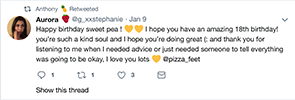
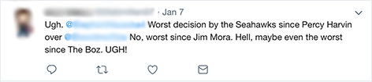
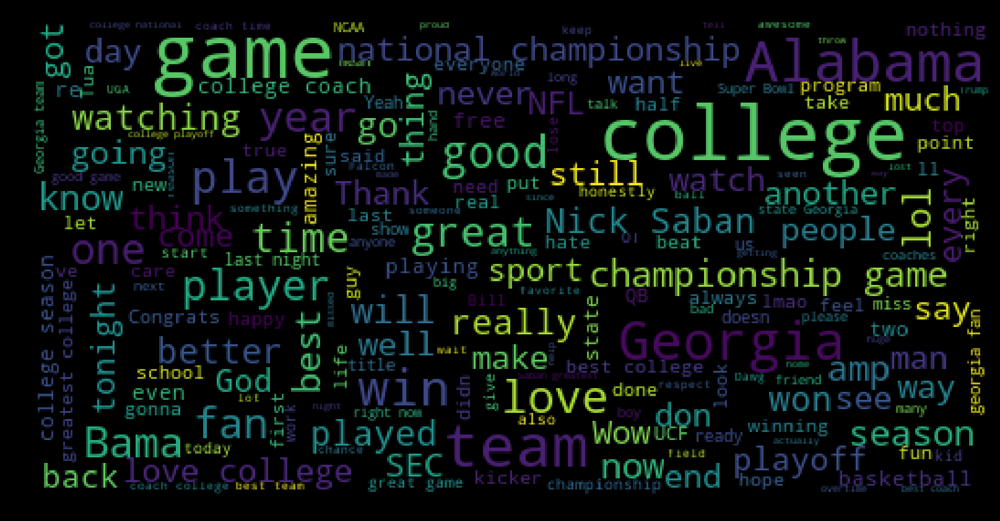
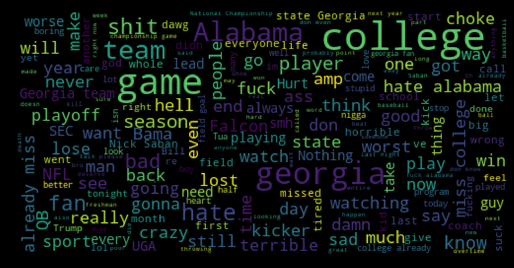

# Twitter Sentiment Analysis in Under 140 Characters
  
*Tyler Atkinson*
  
---
Using machine learning and natural-language-processing to determine whether someone is happy or not, based off of their tweets.

www.twittersentiment.com

# Table of Contents
  1. [Motivation for project](#motivation)
  2. [Collecting and Cleaning Data](#collecting-data)
  3. [Modeling](#modeling)
  4. [Why is sentiment important?](#why-is-sentiment-important)
  
## Motivation
**What is sentiment analysis?**  
Sentiment analysis identifies if a piece of text is positive, neutral, or negative depending on the type of wording they use, any emoji's etc. An example of positive and negative tweets would look like:

  
Positive Sentiment          |  Negative Sentiment
:--------------------------:|:-------------------------:
 |  
  
  
## Collecting Data
I collected my data using twitter's streaming API. Over the course of about a week I collected a total of 800k tweets that were sent out from the United States. After receiving a tweet from the API, I parsed it to pull out only the data I wanted: the text, time, location, etc and saved it to a mongo database. 
#### Cleaning Data
In order to get my data ready for any type of exploratory analysis or modeling I used regex to:
- Remove links
- Remove user '@' handles
- Remove hashtags
  
  
## Modeling
#### Getting Sentiment
The majority of sentiment analysis approaches take one of two forms: polarity-based, where pieces of texts are classified as either positive or negative, or valence-based, where the intensity of the sentiment is taken into account. The method I used to classify tweets as happy, neutral, or sad uses both approaches.  
  
To get sentiment, I used a package built into the python package nltk called Vader which stands for Valence Aware Dictionary and sEntiment Reasoner. It is a lexicon and rule-based sentiment analyzer that performs extremely well with sentiments expressed in social media. Social media is hard for natural language processing because people rarely use proper sentence structure and tend to use a lot of slang, and this is where Vader outperforms other tools.
Using the examples from above, we can get a sentiment score of the tweet. After cleaning the text we get a score composite score of .99 and -.98 respectively.
~~~
'Happy birthday sweet pea ! 💛💛 I hope you have an amazing 18th birthday!
you’re such a kind soul and I hope you’re doing great (: and thank you for
listening to me when I needed advice or just needed someone to tell everything
was going to be okay, I love you lots 💛'
>>> {'compound': 0.9884, 'neg': 0.0, 'neu': 0.499, 'pos': 0.501}

'Ugh.  Worst decision by the Seahawks since Percy Harvin over  No, worst since
Jim Mora. Hell, maybe even the worst since The Boz. UGH!'
>>> {'compound': -0.9793, 'neg': 0.602, 'neu': 0.398, 'pos': 0.0}
~~~
  
#### Building my own Model
After labeling my tweets on a scale from -1 to 1, I decided to create a range for positive, neutral, and negative tweets and chose the following scale  

| Compound Score      | Label      |
| :-----------------: | :--------: |
| >= 0.1              | positive   |
| > -0.1 and < 0.1    | neutral    |
| <= -0.1             | negative   |

I then created combinations of the following models paired with both CountVectorizer and TfidfVectorizer: Naive Bayes, LinearSVC, and Random Forest Classifier. Ultimately, the LinearSVC along with CountVectorizer performed the best.  
  
CountVectorizer works by turning a collection of text documents (in my case tweets) into a sparse matrix of token counts without any stop words (the, is, a, so, very, etc).  
For example, the tweet 'Happy birthday sweet pea ! 💛💛 I hope you have an amazing 18th birthday!' would be turned into  
  
| Token | Count |
| :----:| :----:|
| 18th  |  1    |
| amazing  |  1    |
| an  |  1    |
| birthday  |  2    |
| happy  |  1    |
| have  |  1    |
| hope  |  1    |
| pea  |  1    |
| sweet  |  1    |
| you  |  1    |
  
This step also prepares my data for modeling, since you cannot enter raw text into LinearSVC. LinearSVC works by plotting your data, and it tries to find a hyperplane that separates classes in this feature space. For my application, these classes consisted of tweets that were positive, neutral, or negative. An optimal separating hyperplane separates classes and maximized the margin between the classes. An example of this might look like this  
  
You can adjust these margins depending on your use case, a hard (smaller) margin will be accurate and a soft (bigger) margin will be better at generalization. For my project I did not have to adjust this parameter. 
  
## Why is sentiment important?
If you have a happy or sad label for tweets, you can filter through them by certain keywords or hashtags and look at what "happy" and "not happy" people are saying. For example, if we wanted to look at what people were saying about the college football championship game on January 8th, we could filter by the keywords **"football, Alabama, Georgia"** and generate the following word clouds.
 
#### Can you guess which one is positive and which one is negative?  
**(hint: the top one is positive)**
  

You can get statistics about these tweets as well. In the above example, there were 374 postive tweets with an average sentiment of .54, and 161 negative tweets with an average sentiment of -.49. 
  
### Hashtag Analysis
Another tool I used was building semantic plots to visualize topics. To get these topics I used LDA or Latent Dirichlet Allocation. 
  
  
  
## References
  **Hutto, C.J. & Gilbert, E.E. (2014). VADER: A Parsimonious Rule-based Model for Sentiment Analysis of Social Media Text. Eighth International Conference on Weblogs and Social Media (ICWSM-14). Ann Arbor, MI, June 2014.** 

