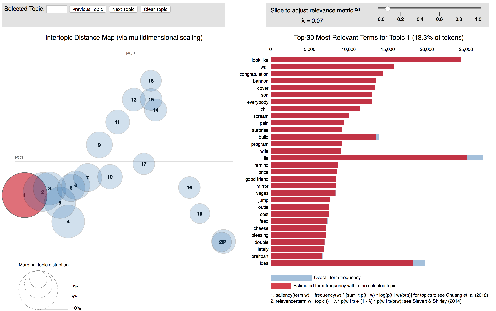

# Twitter Sentiment Analysis  
  
Tyler Atkinson
  
---
Using machine learning and natural-language-processing to determine whether someone is happy or not, based off of their tweets.

# Table of Contents
  1. [Motivation for project](#motivation)
  2. [Collecting and Cleaning Data](#data)
  3. [Modeling](#modeling)
  
## Motivation
**What is sentiment analysis?**  
Sentiment analysis is simply working out if a piece of text is positive, neutral, or negative depending on the type of wording they use, any emoji's etc. An example of a happy tweet might be: 
  
Positive Sentiment          |  Negative Sentiment
:--------------------------:|:-------------------------:
 |  
  
  
## Collecting Data
I collected my data using twitter's streaming API. Over the course of about a week I collected a total of 800k tweets that were sent out from the United States. 
#### Cleaning Data
In order to get my data ready for any type of exploratory analysis or modeling I used regex to:
- Remove links
- Remove user '@' handles
- Remove hashtags
  
  
## Modeling
#### Getting Sentiment
The majority of sentiment analysis approaches take one of two forms: polarity-based, where pieces of texts are classified as either positive or negative, or valence-based, where the intensity of the sentiment is taken into account. The method I used to classify tweets as happy, neutral, or sad uses both approaches.  
  
To get sentiment, I used a package built into the python package nltk called Vader which stands for Valence Aware Dictionary and sEntiment Reasoner. It is a lexicon and rule-based sentiment analyzer that performs extremely well with sentiments expressed in social media. Social media is hard for natural language processing because people rarely use proper sentence structure and tend to use a lot of slang, and this is where Vader outperforms other tools.
Using the examples from above, we can get a sentiment score of the tweet. After cleaning the text we get a score composite score of .99 and -.98 respectively.
~~~
'Happy birthday sweet pea ! 💛💛 I hope you have an amazing 18th birthday!
you’re such a kind soul and I hope you’re doing great (: and thank you for
listening to me when I needed advice or just needed someone to tell everything
was going to be okay, I love you lots 💛'
------- {'compound': 0.9884, 'neg': 0.0, 'neu': 0.499, 'pos': 0.501}

'Ugh.  Worst decision by the Seahawks since Percy Harvin over  No, worst since
Jim Mora. Hell, maybe even the worst since The Boz. UGH!'
------- {'compound': -0.9793, 'neg': 0.602, 'neu': 0.398, 'pos': 0.0}
~~~
  
#### Building my own Model
After labeling my tweets on a scale from -1 to 1, I decided to create a range for positive, neutral, and negative tweets. At first, 
I chose the following scale  

| Compound Score      | Label      |
| :-----------------: | :--------: |
| >= 0.5              | positive   |
| > -0.5 and < 0.5    | neutral    |
| <= -0.5             | negative   |

I then created combinations of the following models paired with both CountVectorizer and TfidfVectorizer: Naive Bayes, LinearSVC, and Random Forest Classifier. Ultimately, the LinearSVC along with CountVectorizer performed the best.
  
  
#### LDA

